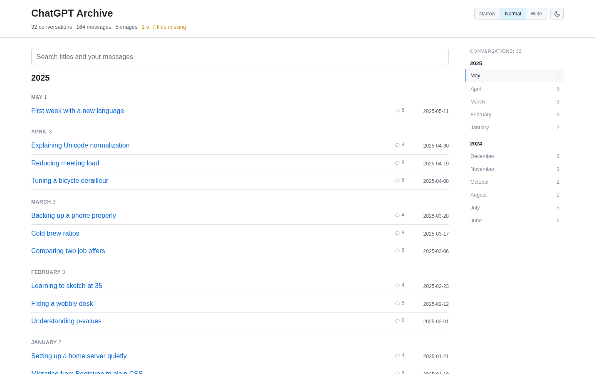
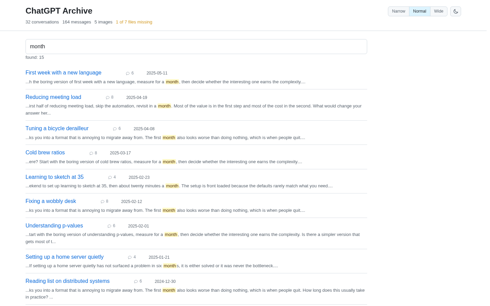
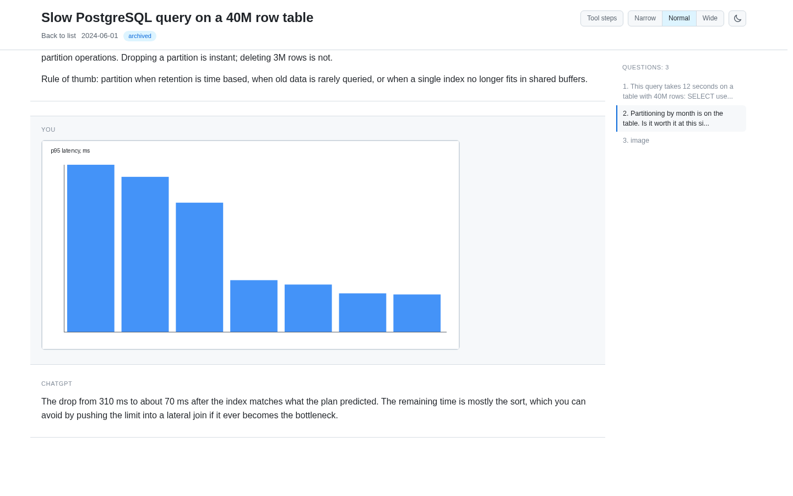
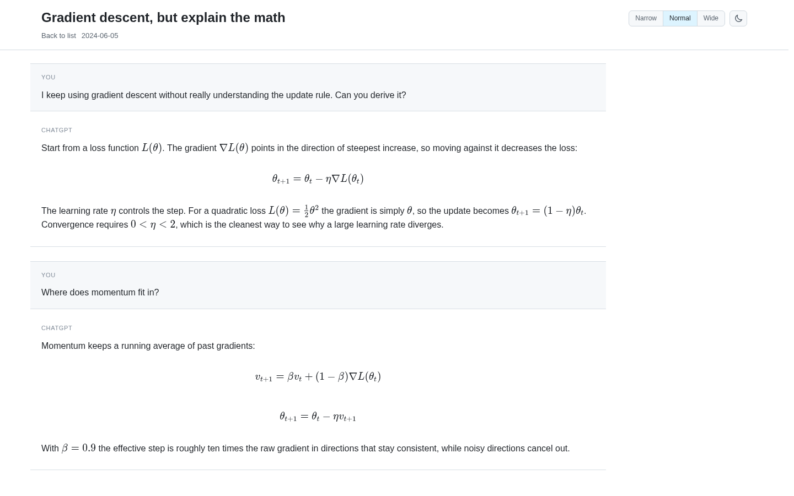

# ChatGPT Export Viewer

[](https://github.com/Gusarovv/chatgpt-export-viewer/actions/workflows/tests.yml)
[](LICENSE)
[](https://www.python.org/downloads/)
[](build_site.py)

Turn your ChatGPT data export into a local static site you can actually read: full-text search, images, LaTeX math, per-conversation contents. No upload, no server, no account.

**[Open the live demo](https://gusarovv.github.io/chatgpt-export-viewer/)**: a generated archive of invented conversations, so you can see the result before running anything.

<picture>
  <source media="(prefers-color-scheme: dark)" srcset="docs/screenshot-index-dark.png">
  
</picture>

## The problem

You asked ChatGPT for your data, waited a few days, and got a ZIP. Inside there is a `conversations.json` written as one endless line, a `chat.html` that dumps every conversation onto a single page with no search, and a pile of files called `file_0a1b2c3d.dat` with no extension.

If your export is recent, `conversations.json` may not even exist. It arrives split into `conversations-000.json`, `conversations-001.json` and so on, and an export requested through the Privacy Portal buries those shards inside a second ZIP. Tools that only look for the single file quietly show you a fraction of your history, or nothing at all.

## What you get

- **Search across everything you and the model wrote**, with the matching sentence shown under each hit
- **Images inline**, including the extension-less `.dat` attachments from 2026-era exports
- **LaTeX rendered** with KaTeX bundled locally, not fetched from a CDN
- **The thread as it was**, reconstructed from `current_node` back through parent links, so edits and regenerations do not scramble the order
- **Reasoning and tool steps** folded into one collapsible block per turn instead of being dropped
- **A missing-files report**: how many attachments your conversations reference, how many the export actually contains, and which conversations lost the most
- **Year and month navigation** with a sticky table of contents, dark and light themes, three reading widths
- Everything is static. Copy the folder to a USB stick and it still works.

<picture>
  <source media="(prefers-color-scheme: dark)" srcset="docs/screenshot-search-dark.png">
  
</picture>

<picture>
  <source media="(prefers-color-scheme: dark)" srcset="docs/screenshot-conversation-dark.png">
  
</picture>

<picture>
  <source media="(prefers-color-scheme: dark)" srcset="docs/screenshot-math-dark.png">
  
</picture>

## Quick start

Ask ChatGPT for the export first: **Settings**, **Data controls**, **Export data**, **Confirm export**. The download link arrives by email and expires 24 hours later.

You need Python 3.8 or newer. Pillow is optional and only used to reserve image dimensions.

```bash
git clone https://github.com/Gusarovv/chatgpt-export-viewer.git
cd chatgpt-export-viewer
python3 build_site.py ~/Downloads/your-export.zip
```

The site lands next to the export, in `your-export-site/`. Open `your-export-site/site/index.html` in any browser.

An unpacked export works too:

```bash
python3 build_site.py ~/Downloads/your-export/ ~/my-archive
```

### Never used a terminal?

1. Install Python from [python.org](https://www.python.org/downloads/). On Windows, tick "Add Python to PATH" during setup.
2. Download this project with the green **Code** button, then **Download ZIP**, and unpack it.
3. Open the unpacked folder, then open a terminal there: on Windows, type `cmd` in the address bar of the folder window and press Enter; on macOS, right-click the folder and choose **New Terminal at Folder**.
4. Type `python3 build_site.py ` (with the trailing space), then drag your export ZIP onto the window and press Enter.
5. When it finishes, it prints the path to `index.html`. Open that file.

## Build a demo archive

The repository ships a generator for a fake export, so you can try the tool without touching your own data:

```bash
python3 tests/make_demo_export.py demo-export.zip
python3 build_site.py demo-export.zip
```

That gives you 450 conversations spread over three years, with images, math, code, tables, tool steps and a deliberately missing attachment. Pass `--conversations N` to the generator for a smaller or larger archive.

## Limitations

- **Official exports from mid-2026 no longer contain `tool` and `system` messages.** Code interpreter output, web search results and Canvas documents are stripped on OpenAI's side before the ZIP is built. What remains, this tool shows; what is gone, no reader can recover.
- **Attachments go missing.** Exports regularly reference files they do not include: sometimes a random subset of generated images, sometimes all of them. That is why the missing-files report exists.
- **Project names are not in the export**, only opaque gizmo identifiers, so conversations that belonged to a project are shown without a project label.
- **The format changes without notice.** Field names appear and disappear between exports. The parser treats almost everything as optional and logs what it skips instead of failing.

## How it works

`build_site.py` is a single file with no dependencies. It:

1. Finds conversation shards through `export_manifest.json`, falling back to a filename pattern, and opens the nested archive a Privacy Portal export wraps them in.
2. Streams each shard, so a 300 MB single-line JSON never lands in memory whole.
3. Walks each conversation from `current_node` up the `parent` chain, iteratively, because some threads run over 1200 nodes deep, past Python's recursion limit.
4. Resolves attachments through `conversation_asset_file_names.json`, restoring extensions from file signatures.
5. Writes HTML, a small search index, a lazy full-text index, and the missing-files report.

## License

MIT
